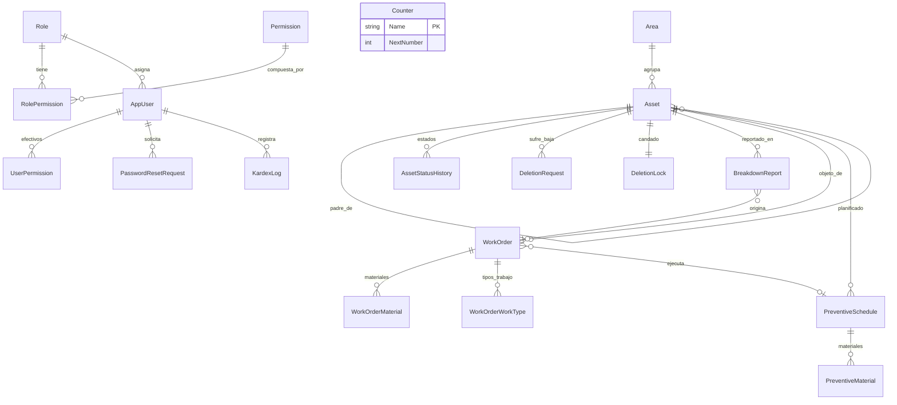

# Diseño de Base de Datos SQL Server — Migración Firestore → T-SQL

Blueprint 1:1 de las colecciones Firestore del sistema CMMS Grupo Macsa hacia **SQL Server (T-SQL)**.
Cada tabla, columna, restricción y procedimiento almacenado deriva de una fuente verificable del código:

| Fuente en el repo | De qué se deriva |
|---|---|
| `firestore.rules` | Restricciones de integridad (enums, inmutables, append-only, sin borrado físico) |
| `lib/features/*/data/models/*.dart` (`fromFirestore`/`toFirestore`) | Campos y tipos exactos |
| `lib/features/*/data/repositories/*.dart` y `data/datasources/*.dart` | Cada consulta/transacción = un SP |
| `lib/features/auth_permissions/domain/entities/user_role.dart` | Catálogo de roles y permisos |
| `firestore.indexes.json` | Índices requeridos |

> El `init.sql` ejecutable se generará a partir de este documento en `database/init.sql`.

---

## 1. Convenciones y buenas prácticas

- **Esquema**: todo en `dbo`. Nombres de tablas en **singular + PascalCase** (`dbo.Asset`, `dbo.WorkOrder`).
- **SPs**: `usp<Entidad><Acción>` (p. ej. `uspAssetCreate`). Funciones `fn*`, vistas `vw*`, triggers `tr<Tabla>_<Evento>`.
- **Tipos**: `NVARCHAR` para TODO texto (UI en español: acentos/ñ); `DATETIME2(3)` siempre **UTC** (`SYSUTCDATETIME()` como default, Firestore Timestamps son UTC); `BIT` bools; `DECIMAL(10,2)` horas/cantidades; `INT`/`BIGINT` contadores.
- **Collation de columnas de usuario**: `Latin1_General_CI_AI` (case/acento-insensible). Replica el lookup de login tal-cual → minúsculas → MAYÚSCULAS del repo actual y la tokenización sin acentos de búsqueda.
- **Sin borrado físico**: ningún flujo hace `DELETE`; las bajas son lógicas por columna de estado (espejo de `delete: if false` en rules). El rol de la app (`macsa_app`) tendrá solo `EXEC` sobre SPs.
- **Atomicidad**: cada operación que en Firestore usa `runTransaction` es UN SOLO SP transaccional con `SET XACT_ABORT ON`, `TRY/CATCH`, `THROW` (mensajes en español, mismos textos que los `ValidationFailure` actuales) y candados explícitos:
  - Contador: `UPDATE dbo.Counter WITH (UPDLOCK, HOLDLOCK) ... OUTPUT` (reemplaza el doc `counters/*`).
  - Candado de bajas: `SELECT ... FROM dbo.DeletionLock WITH (UPDLOCK, HOLDLOCK)` (reemplaza `deletion_request_states`).
- **Append-only**: `dbo.KardexLog` con `DENY UPDATE, DELETE` + trigger guardián; toda mutación escribe su evento **dentro de la misma transacción** del SP (igual que hoy).
- **Inmutabilidad**: campos jerárquicos de activos protegidos por trigger `INSTEAD OF UPDATE` (equivalente exacto de las rules).
- **Optimistic concurrency**: columna `RowVersion ROWVERSION` en tablas mutables.
- Estilo: `SET NOCOUNT ON` en todos los SPs, cero `SELECT *`, operaciones set-based (sin cursores), nombres de parámetros explícitos, un SP = una responsabilidad.

---

## 2. Relaciones (ER)



Reglas relacionales (todas `ON DELETE NO ACTION` — nunca hay borrado físico):

| Relación | Implementación |
|---|---|
| Área → activos raíz | `Asset.AreaId` FK → `Area.AreaId` (inmutable) |
| Activo padre → hijos | `Asset.ParentAssetCode` FK autorreferencial NULL (inmutable) |
| Historial de estados | `AssetStatusHistory.AssetCode` FK; **máx. un período abierto** (índice único filtrado `WHERE EndedAt IS NULL`) |
| Solicitud de baja | `DeletionRequest.AssetCode` FK inmutable; candado 1:1 `DeletionLock.AssetCode` |
| Avería ↔ OT | `BreakdownReport.WorkOrderId` FK NULL → `WorkOrder.WorkOrderId`; `WorkOrder.ReportId` FK NULL → `BreakdownReport.ReportId` (vínculo bidireccional como hoy) |
| OT preventiva | `PreventiveSchedule.LastWorkOrderId` FK NULL → `WorkOrder` |
| Permisos | catálogo `Role/RolePermission` + snapshot efectivo `UserPermission` (replica el array `permissions` del documento actual) |

---

## 3. Tablas

### 3.1 Catálogos y contadores

#### `dbo.Role` — derivado de `UserRole` (`user_role.dart`)
| Columna | Tipo | Notas |
|---|---|---|
| RoleCode | NVARCHAR(20) PK | `admin \| jefe \| reportador \| lector` |
| Label | NVARCHAR(50) NOT NULL | 'Administrador', 'Jefe', … |

#### `dbo.Permission` — derivado de `AppPermissions`
| Columna | Tipo | Notas |
|---|---|---|
| PermissionCode | NVARCHAR(50) PK | `dashboard.view`, `asset.create`, `asset.edit`, `asset.transfer`, `asset.delete.request`, `asset.delete.approve`, `work_order.view/create/print`, `preventive.view`, `kardex.view`, `breakdown.report/view/manage`, `user.manage` |

#### `dbo.RolePermission`
| Columna | Tipo |
|---|---|
| RoleCode | NVARCHAR(20) FK, PK compuesto |
| PermissionCode | NVARCHAR(50) FK, PK compuesto |

Semilla = `defaultPermissions` del switch de `UserRole`. El bypass del `admin` sigue viviendo en la app (`AppUser.hasPermission`).

#### `dbo.Counter` — reemplaza docs `counters/{areas|work_orders|preventive_schedules}`
| Columna | Tipo | Notas |
|---|---|---|
| Name | NVARCHAR(30) PK | `'areas'`, `'work_orders'`, `'preventive_schedules'` |
| NextNumber | INT NOT NULL CHECK (>0) | Se reclama con `UPDLOCK, HOLDLOCK` |

> Detalle exacto: hoy `nextNumber` de OT/PM **nunca se reinicia por año**; el año solo se incrusta en el correlativo (`OT-2026-0007`). El diseño conserva esa semántica global.

### 3.2 Seguridad (feature `auth_permissions`)

#### `dbo.AppUser` — reemplaza `/users`
| Columna | Tipo | Mapeo / Regla (rules) |
|---|---|---|
| UserId | INT IDENTITY PK | doc-id |
| Username | NVARCHAR(100) NOT NULL UNIQUE, COLLATE CI_AI | inmutable (rules); el lookup CI replica tal cual/minús/MAYÚS |
| DisplayName | NVARCHAR(200) NULL | |
| RoleCode | NVARCHAR(20) NOT NULL FK→Role | campo `role` |
| PasswordSalt | NVARCHAR(24) NOT NULL | base64 16 B (PBKDF2, se mantiene en cliente Dart) |
| PasswordHash | NVARCHAR(44) NOT NULL | base64 32 B |
| PasswordIterations | INT NOT NULL CHECK (>0), DEFAULT 20000 | migración de iteraciones soportada |
| Disabled | BIT NOT NULL DEFAULT 0 | bloquea login |
| MustChangePassword | BIT NOT NULL DEFAULT 1 | |
| PasswordResetRequested | BIT NOT NULL DEFAULT 0 | alimenta el listener de alertas (polling) |
| PasswordResetRequestedAt | DATETIME2(3) NULL | |
| FailedLoginAttempts | INT NOT NULL DEFAULT 0 | 5 fallidos → LockedUntil |
| LockedUntil | DATETIME2(3) NULL | +5 minutos |
| CreatedAt | DATETIME2(3) NOT NULL DEFAULT SYSUTCDATETIME() | |
| RowVersion | ROWVERSION | |

> PROHIBIDO cualquier columna `Password` en claro (rules lo prohíben explícitamente).

#### `dbo.UserPermission` — snapshot del array `permissions`
| Columna | Tipo |
|---|---|
| UserId | INT FK, PK compuesto |
| PermissionCode | NVARCHAR(50) FK→Permission, PK compuesto |

Se puebla desde `RolePermission` al crear usuario o cambiar rol (`uspUserCreate` / `uspUserUpdate`). Alternativa futura: derivar por JOIN y eliminar la tabla.

#### `dbo.PasswordResetRequest` — reemplaza `/password_reset_requests`
| Columna | Tipo | Mapeo |
|---|---|---|
| RequestId | BIGINT IDENTITY PK | |
| UserId | INT NOT NULL FK→AppUser | |
| Username | NVARCHAR(100) NOT NULL | snapshot |
| DisplayName | NVARCHAR(200) NULL | snapshot |
| RoleCode | NVARCHAR(20) NOT NULL | snapshot |
| RequestedAt | DATETIME2(3) NOT NULL DEFAULT SYSUTCDATETIME() | |
| Status | NVARCHAR(15) NOT NULL DEFAULT 'pending' CHECK IN ('pending','resolved') | hoy solo se escribe 'pending' |
| Details | NVARCHAR(500) NULL | |

### 3.3 Activos (features `assets` y `asset_deletion`)

#### `dbo.Area` — reemplaza `/areas`
| Columna | Tipo | Mapeo |
|---|---|---|
| AreaId | NVARCHAR(15) PK | doc-id; generado `A%03d` vía `Counter['areas']` o ID custom |
| Name | NVARCHAR(200) NOT NULL | |
| CostCenter | NVARCHAR(20) NOT NULL | normalizado `CC-xx` en el SP |
| AssetCounter | INT NOT NULL DEFAULT 0 | contador embebido de equipos `{área}-00N` (se reclama con UPDLOCK sobre la fila) |
| CreatedAt / UpdatedAt | DATETIME2(3) | |

#### `dbo.Asset` — reemplaza `/assets` (PK = código relacional)
| Columna | Tipo | Mapeo / Regla |
|---|---|---|
| AssetCode | NVARCHAR(60) PK | doc-ID: equipo `{área}-00N`, hijo `{padre}-NN` (contadores embebidos) |
| Name | NVARCHAR(200) NOT NULL | |
| Brand / Model | NVARCHAR(100) NULL | |
| AreaId | NVARCHAR(15) NOT NULL FK→Area | **inmutable** |
| StationId | NVARCHAR(100) NOT NULL DEFAULT '' | |
| ParentAssetCode | NVARCHAR(60) NULL FK self | **inmutable** |
| Level | NVARCHAR(20) NOT NULL CHECK IN ('equipment','subEquipment','part','subPart') | **inmutable**, derivado de la profundidad |
| AncestorsPath | NVARCHAR(400) NOT NULL DEFAULT '' | **inmutable**; ruta materializada coma-separada (`A3-002,A3-002-01`); subárbol = `CHARINDEX(','+@code+',', ','+AncestorsPath+',') > 0` |
| Status | NVARCHAR(25) NOT NULL DEFAULT 'active' CHECK IN ('active','transferredDeactivated','inactive','deleted') | enum de rules |
| TransferredToId | NVARCHAR(60) NULL | solo en la raíz transferida |
| Serial | NVARCHAR(100) NULL | **inmutable si existe**; unicidad contra NO eliminados se valida en `uspAssetCreate` (NO índice UNIQUE: tras un traspaso conviven original desactivado + copia activa con el mismo serial, igual que hoy con `findBySerial limit(2)`) |
| DynamicAttributes | NVARCHAR(MAX) NULL CHECK (value IS JSON) | mapa libre |
| ImageData | NVARCHAR(MAX) NULL CHECK (LEN(value) < 1100000) | data-URL base64 < 1.1 MiB (regla literal de rules) |
| ChildCounter | INT NOT NULL DEFAULT 0 | contador embebido de hijos |
| DeletedAt / DeletedByUserId / DeletedByUserName | — NULL | escritos solo al aprobar baja |
| CreatedAt / UpdatedAt | DATETIME2(3) | |
| SearchText | NVARCHAR(MAX) **PERSISTED COMPUTED** | concat normalizada de `AssetCode+Name+Brand+Model+Serial` para búsqueda AND con `LIKE '%tok%'` (collation CI_AI ≡ tokenizador sin acentos de `Asset.tokenize`) |
| RowVersion | ROWVERSION | |

Índice único filtrado: `UNIQUE (ParentAssetCode, ???)` no aplica; ver §5.

#### `dbo.AssetStatusHistory` — desnormaliza el array embebido `statusHistory`
| Columna | Tipo | Mapeo (`AssetStatusPeriod.toMap`) |
|---|---|---|
| HistoryId | BIGINT IDENTITY PK | |
| AssetCode | NVARCHAR(60) FK NOT NULL | |
| Status | NVARCHAR(25) CHECK enum NOT NULL | |
| StartedAt | DATETIME2(3) NOT NULL | ISO8601 hoy |
| EndedAt | DATETIME2(3) NULL | NULL = período vigente |
| AreaId | NVARCHAR(15) NOT NULL | |
| Reason | NVARCHAR(500) NULL | |
| UserId | INT NULL FK→AppUser / UserName NVARCHAR(200) NULL | |

Índice único filtrado `(AssetCode) WHERE EndedAt IS NULL` → garantiza un solo período abierto (hoy la lógica cierra el anterior manualmente).

#### `dbo.DeletionRequest` — reemplaza `/deletion_requests`
| Columna | Tipo | Mapeo / Regla |
|---|---|---|
| RequestId | BIGINT IDENTITY PK | |
| AssetCode | NVARCHAR(60) FK NOT NULL | **inmutable** (rules) |
| AssetName / AreaId | snapshot | |
| Status | NVARCHAR(10) NOT NULL CHECK IN ('pending','approved','rejected') | enum de rules |
| Reason | NVARCHAR(1000) NOT NULL | obligatorio |
| RequestedByUserId INT FK / RequestedByUserName | NOT NULL | |
| RequestedAt | DATETIME2(3) NOT NULL | |
| SubtreeCount | INT NOT NULL DEFAULT 0 | afectados informados al aprobador |
| DecidedByUserId INT NULL FK / DecidedByUserName / DecidedAt / DecisionReason | NULL | resolución única |

Índices: `(Status, RequestedAt DESC)` y `(AssetCode, Status)` (de `firestore.indexes.json`).

#### `dbo.DeletionLock` — reemplaza `/deletion_request_states` (candado transaccional 1:1)
| Columna | Tipo | Regla |
|---|---|---|
| AssetCode | NVARCHAR(60) FK PK | |
| LockStatus | NVARCHAR(10) NOT NULL CHECK IN ('pending','approved','rejected') | |
| UpdatedAt | DATETIME2(3) NOT NULL | |

Leído SIEMPRE con `UPDLOCK, HOLDLOCK` al inicio de toda transacción de alta/edición/traspaso/reactivación/cambio de estado/resolución (aborta si `pending`).

### 3.4 Órdenes de trabajo (feature `work_orders`)

#### `dbo.WorkOrder` — reemplaza `/work_orders` (PK = correlativo)
| Columna | Tipo | Mapeo |
|---|---|---|
| WorkOrderId | NVARCHAR(20) PK | `OT-<año>-<NNNN>` generado en el SP vía `Counter['work_orders']` (= `correlativeNumber`, hoy ambos son iguales) |
| AssetCode | NVARCHAR(60) NULL FK→Asset | puede ser vacío hoy → NULL aquí; rechaza activos `transferredDeactivated`/`deleted` (validación del SP) |
| AssetName | NVARCHAR(200) NOT NULL | snapshot |
| AreaId NVARCHAR(15) NULL FK / AreaName | snapshot | |
| Description | NVARCHAR(MAX) NOT NULL CHECK (LTRIM <> '') | |
| Status | NVARCHAR(15) NOT NULL DEFAULT 'pending' CHECK IN ('pending','inProgress','completed','cancelled') | transiciones válidas en `uspWorkOrderUpdateStatus` |
| Priority | NVARCHAR(10) NOT NULL DEFAULT 'medium' CHECK IN ('low','medium','high') | |
| AssignedTo NVARCHAR(200) / AssignedStaffCount INT / EstimatedHours DECIMAL(6,2) / ActualHours DECIMAL(6,2) | NULL | |
| WorkDoneDescription NVARCHAR(MAX) NULL | | |
| IsCompleted BIT NULL / UnfulfillmentReason NVARCHAR(500) NULL / ReprogramDate DATETIME2(3) NULL | | cumplimiento/reprogramación |
| AccHaccpResponsible / MaintenanceResponsible / AreaHeadResponsible / MaintenanceHeadResponsible | NVARCHAR(200) NULL | firmas formato REG.GMC-MTN-001 |
| ScheduledDate DATETIME2(3) NULL | | |
| ReportId BIGINT NULL FK→BreakdownReport | | avería de origen |
| CreatedByUserId INT NULL FK / CreatedByUserName | | |
| CreatedAt | DATETIME2(3) NOT NULL DEFAULT SYSUTCDATETIME() | |
| RowVersion | ROWVERSION | |

#### `dbo.WorkOrderMaterial` — desnormaliza `materials[]`
| Columna | Tipo |
|---|---|
| WorkOrderId | NVARCHAR(20) FK, PK compuesto |
| LineNo | INT, PK compuesto |
| Description | NVARCHAR(200) NOT NULL |
| Quantity | DECIMAL(10,2) NOT NULL DEFAULT 1 |
| Unit | NVARCHAR(10) NOT NULL DEFAULT 'pz' |

#### `dbo.WorkOrderWorkType` — desnormaliza `requestedWorkTypes[]`
| Columna | Tipo |
|---|---|
| WorkOrderId | NVARCHAR(20) FK, PK compuesto |
| WorkType | NVARCHAR(30) CHECK IN ('electric','mechanical','urgency','refrigeration','plumbing','preventive','corrective','scheduled'), PK compuesto |

### 3.5 Averías (feature `breakdown_reports`)

#### `dbo.BreakdownReport` — reemplaza `/breakdown_reports`
| Columna | Tipo | Mapeo / Regla |
|---|---|---|
| ReportId | BIGINT IDENTITY PK | |
| AssetCode | NVARCHAR(60) FK NOT NULL | **inmutable** |
| AssetName | NVARCHAR(200) NOT NULL | **inmutable** |
| AreaId | NVARCHAR(15) NOT NULL | **inmutable** |
| Description | NVARCHAR(MAX) NOT NULL | |
| Severity | NVARCHAR(10) NOT NULL CHECK IN ('low','medium','high') | |
| ReportedByUserId INT NOT NULL FK / ReportedByUserName | **inmutables** | |
| ReportedAt | DATETIME2(3) NOT NULL DEFAULT SYSUTCDATETIME() | |
| Status | NVARCHAR(15) NOT NULL DEFAULT 'reported' CHECK IN ('reported','inWorkOrder','resolved','rejected') | |
| WorkOrderId | NVARCHAR(20) NULL FK→WorkOrder | vínculo al atender |
| ResolvedByUserId INT NULL FK / ResolvedByUserName / ResolvedAt | NULL | |
| RejectionReason NVARCHAR(500) NULL / RejectedByUserId INT NULL FK / RejectedByUserName / RejectedAt | NULL | |

### 3.6 Preventivos (feature `preventive_schedules`)

#### `dbo.PreventiveSchedule` — reemplaza `/preventive_schedules` (PK = correlativo)
| Columna | Tipo | Mapeo |
|---|---|---|
| ScheduleId | NVARCHAR(20) PK | `PM-<año>-<NNNN>` vía `Counter['preventive_schedules']` |
| Title | NVARCHAR(200) NOT NULL | default `'Plan Preventivo {id}'` |
| AssetCode NVARCHAR(60) FK / AssetName / AreaId FK / AreaName | NOT NULL | |
| MaintenanceType | NVARCHAR(100) NOT NULL | texto libre hoy |
| Frequency | NVARCHAR(15) NOT NULL CHECK IN ('daily','weekly','biweekly','monthly','bimonthly','quarterly','semiannual','annual') | días: 1/7/15/30/60/90/180/365 (`fnFrequencyDays`) |
| Description NVARCHAR(MAX) NULL / EstimatedHours DECIMAL(6,2) NULL | | |
| StartDate / NextDate | DATETIME2(3) NOT NULL | NextDate ordena la bandeja |
| LastCompleted DATETIME2(3) NULL / LastWorkOrderId NVARCHAR(20) NULL FK | | ejecución vía OT |
| Status | NVARCHAR(10) NOT NULL DEFAULT 'active' CHECK IN ('active','paused','completed') | cambios exigen oficio+gerente+motivo (SP) |
| Notes NVARCHAR(500) NULL | | |
| CreatedByUserId INT FK / CreatedByUserName / CreatedAt | | |
| AmendmentDocNumber NVARCHAR(50) NULL / AmendedBy NVARCHAR(250) NULL / AmendedAt DATETIME2(3) NULL / AmendmentReason NVARCHAR(500) NULL | | trazabilidad de modificación gerencial |
| RowVersion | ROWVERSION | |

#### `dbo.PreventiveMaterial` — desnormaliza `materials[]`
`(ScheduleId FK+LineNo PK, Name NVARCHAR(200), Quantity DECIMAL(10,2), Unit DEFAULT 'pza')`.

### 3.7 Auditoría

#### `dbo.KardexLog` — reemplaza `/kardex_logs` (APPEND-ONLY)
| Columna | Tipo | Mapeo |
|---|---|---|
| LogId | BIGINT IDENTITY PK | |
| LoggedAt | DATETIME2(3) NOT NULL DEFAULT SYSUTCDATETIME() | `timestamp` |
| UserId | INT NULL FK→AppUser | |
| UserName | NVARCHAR(100) NOT NULL | snapshot histórico |
| Action | NVARCHAR(40) NOT NULL CHECK IN (lista §6) | `ASSET_CREATED`, `WORK_ORDER_CREATED`, … |
| Module | NVARCHAR(20) NOT NULL CHECK IN ('ASSETS','WORK_ORDERS','BREAKDOWNS','PREVENTIVE') | |
| EntityId | NVARCHAR(60) NOT NULL | código del activo/OT/PM/report |
| Details | NVARCHAR(MAX) NOT NULL | |

Protección: `DENY UPDATE, DELETE TO macsa_app;` + trigger `trKardexLog_Immutable` que hace `THROW` ante cualquier UPDATE/DELETE (defensa en profundidad).

---

## 4. Índices (traducción de `firestore.indexes.json`)

```sql
CREATE NONCLUSTERED INDEX IX_Asset_Area_Name      ON dbo.Asset(AreaId, Name);
CREATE NONCLUSTERED INDEX IX_Asset_Area_Status    ON dbo.Asset(AreaId, Status, Name);
CREATE NONCLUSTERED INDEX IX_Asset_Serial         ON dbo.Asset(Serial) WHERE Serial IS NOT NULL;
CREATE NONCLUSTERED INDEX IX_History_Open         ON dbo.AssetStatusHistory(AssetCode) WHERE EndedAt IS NULL;
CREATE NONCLUSTERED INDEX IX_WO_Status_Date       ON dbo.WorkOrder(Status, CreatedAt DESC);
CREATE NONCLUSTERED INDEX IX_WO_Asset_Date        ON dbo.WorkOrder(AssetCode, CreatedAt DESC);
CREATE NONCLUSTERED INDEX IX_WO_Area_Date         ON dbo.WorkOrder(AreaId, CreatedAt DESC);
CREATE NONCLUSTERED INDEX IX_Kardex_Entity        ON dbo.KardexLog(EntityId, LoggedAt DESC);
CREATE NONCLUSTERED INDEX IX_Kardex_Module        ON dbo.KardexLog(Module, LoggedAt DESC);
CREATE NONCLUSTERED INDEX IX_Kardex_User          ON dbo.KardexLog(UserId, LoggedAt DESC);
CREATE NONCLUSTERED INDEX IX_PM_Area_Status_Next  ON dbo.PreventiveSchedule(AreaId, Status, NextDate);
CREATE NONCLUSTERED INDEX IX_PM_Status_Next       ON dbo.PreventiveSchedule(Status, NextDate);
CREATE NONCLUSTERED INDEX IX_DR_Status_Req        ON dbo.DeletionRequest(Status, RequestedAt DESC);
CREATE NONCLUSTERED INDEX IX_DR_Asset_Status      ON dbo.DeletionRequest(AssetCode, Status);
CREATE NONCLUSTERED INDEX IX_BR_Reporter_Date     ON dbo.BreakdownReport(ReportedByUserId, ReportedAt DESC);
CREATE NONCLUSTERED INDEX IX_BR_Status_Date       ON dbo.BreakdownReport(Status, ReportedAt DESC);
CREATE NONCLUSTERED INDEX IX_BR_Area_Status_Date  ON dbo.BreakdownReport(AreaId, Status, ReportedAt DESC);
```

La búsqueda por texto (`searchTerms` + refinamiento AND en cliente) se resuelve con:

```sql
-- Todos los tokens deben coincidir (semántica AND exacta del tokenizador Dart):
SELECT a.* , cnt.Tokens
FROM dbo.Asset a
CROSS APPLY (SELECT COUNT(*) Tokens FROM STRING_SPLIT(@Search, ' ') WHERE LTRIM(RTRIM(value)) <> '') cnt
WHERE a.AreaId = @AreaId AND a.Status <> 'deleted'
  AND (SELECT COUNT(*) FROM STRING_SPLIT(@Search, ' ') t
       WHERE t.value <> '' AND a.SearchText LIKE '%'+t.value+'%') = cnt.Tokens
ORDER BY a.Name;
```

Para volumen alto: FULLTEXT INDEX sobre `SearchText` con `CONTAINS(... ' AND ')`. La collation CI_AI ya ignora acentos/mayúsculas (equivalente al tokenizador que quita acentos).

---

## 5. Triggers e integridad equivalente a `firestore.rules`

| Regla en `firestore.rules` | Mecanismo SQL |
|---|---|
| `delete: if false` en todas las colecciones | Sin `DELETE` grants para `macsa_app`; bajas lógicas por `Status` |
| `kardex_logs` append-only | `DENY UPDATE/DELETE` + trigger guardián |
| `assets`: inmutables `areaId,parentAssetId,level,ancestors,serial(si existe)` | `trAsset_Immutable` (INSTEAD OF UPDATE): compara inserted vs deleted y `THROW` si cambian |
| Enums de status/level/severity/frequency | `CHECK` constraints en cada tabla |
| `imageData` < 1.1 MiB | `CHECK (LEN(ImageData) < 1100000)` |
| `users`: sin campo `password`; username inmutable | Solo columnas Salt/Hash/Iterations; `trAppUser_UsernameImmutable` |
| `deletion_requests`: `assetId` inmutable | Trigger o SP-exclusivo de UPDATE (solo cambia Status/decisión) |
| Candado `deletion_request_states` | Lectura `UPDLOCK,HOLDLOCK` de `DeletionLock` al inicio de cada SP mutante |
| Correlativos únicos sin carreras | Reclamo atómico de contadores dentro de la misma transacción |

---

## 6. Procedimientos almacenados (inventario completo)

Convención: `usp<Entidad><Acción>`; todo SP transaccional lleva `SET XACT_ABORT ON`, `TRY/CATCH`, escribe kardex cuando el repo actual lo hace, y valida el candado de bajas cuando corresponde.

### 6.1 Auth (`auth_repository_impl`)
| SP | Equivalente exacto |
|---|---|
| `uspUserGetForLogin(@Username)` → user + salt/hash/iters/attempts/locked/disabled | lookup CI (reemplaza la cadena tal cual→minús→MAYÚS) |
| `uspLoginRegisterFailure(@UserId)` | transacción: `FailedLoginAttempts += 1`; si ≥5 → `LockedUntil = DATEADD(MINUTE,5,SYSUTCDATETIME())` |
| `uspLoginResetAttempts(@UserId)` | `FailedLoginAttempts=0, LockedUntil=NULL` |
| `uspLoginMigrateHash(@UserId,@Salt,@Hash,@Iterations)` | migración de credenciales post-verificación |
| `uspUserCreate(@Username,@DisplayName,@RoleCode,@Salt,@Hash,@Iterations,@MustChangePassword)` | valida unicidad + copia `RolePermission`→`UserPermission` |
| `uspUserUpdate(@UserId,@DisplayName,NULL,@RoleCode,NULL,@Salt,@Hash,@Iterations)` | si cambia rol, re-escribe `UserPermission` |
| `uspUserToggleDisabled(@UserId,@Disabled)` | |
| `uspUserChangePassword(@UserId,@Salt,@Hash,@Iterations)` | limpia MustChangePassword/reset-request/attempts/lock |
| `uspUserResetTemporary(@UserId,@TempSalt,@TempHash,@Iterations)` | igual pero `MustChangePassword=1` |
| `uspPasswordResetRequest(@Username,@Details)` | setea banderas en `AppUser` + INSERT en `PasswordResetRequest` |
| `uspPasswordResetPendingList()` / `uspPasswordResetMarkResolved(@RequestId)` | reemplazo del listener `.snapshots()` (polling) |
| `uspUserGetAll()` / `uspUserGetById(@UserId)` | |

> La verificación PBKDF2 permanece en Dart (`password_hasher.dart`): el SP entrega salt/hash/iteraciones y la app confirma antes de llamar a failure/reset/migrate. Moverla a servidor exigiría CLR u otro mecanismo (PBKDF2 no está en `HASHBYTES`).

### 6.2 Áreas (`area_repository_impl`)
| SP | Notas |
|---|---|
| `uspAreaGetAll()` | ORDER BY AreaId (hoy `orderBy('id')`) |
| `uspAreaCreate(@Name,@CostCenter,@CustomId NULL)` | transacción: si no hay CustomId reclama `Counter['areas']`; normaliza `CC-`; INSERT |
| `uspAreaUpdate(@AreaId,@Name,@CostCenter NULL)` | |

### 6.3 Activos (`asset_repository_impl`, `asset_remote_datasource`)
| SP | Notas clave |
|---|---|
| `uspAssetGetRootsByArea(@AreaId)` | `ParentAssetCode IS NULL AND Status<>'deleted'` ORDER BY Name |
| `uspAssetGetChildren(@AreaId,@ParentAssetCode NULL)` | excluye `deleted` (incluye desactivados por transferencia, como hoy) |
| `uspAssetSearch(@AreaId,@Search,@Status NULL)` | patrón AND de tokens §4 |
| `uspAssetFindBySerial(@Serial)` | `Status<>'deleted'`, prefiere activo |
| `uspAssetCreate(...)` | **transacción completa**: candado pendiente (si hijo) + padre activo + reclamo de contador (`Area.AssetCounter` o `parent.ChildCounter` con UPDLOCK) + unicidad de serial contra NO eliminados + INSERT + período inicial en historial + kardex `ASSET_CREATED` |
| `uspAssetUpdate(...)` | candado + no eliminado; `@ImageData=NULL` borra la imagen (semántica `FieldValue.delete()`); kardex `ASSET_UPDATED` con detalle de campos cambiados |
| `uspAssetTransfer(@AssetCode,@TargetAreaId,@UserId,@UserName)` | valida destino ≠ origen, activo, candado; reclama contador destino; recalcula códigos del subárbol en BFS determinístico (`ORDER BY AssetCode`, mismo algoritmo `assignChildren`); INSERT copias (`serial` solo en nueva raíz); UPDATE origen→`transferredDeactivated` + `TransferredToId`; kardex `ASSET_TRANSFER` |
| `uspAssetReactivate(@AssetCode,@UserId,@UserName)` | solo `transferredDeactivated` + candado; restaura subárbol a `active`; limpia `TransferredToId`; kardex `ASSET_REACTIVATE` |
| `uspAssetToggleStatus(@AssetCode,@NewStatus IN (active,inactive),@Reason,@UserId,@UserName)` | motivo obligatorio; cierra período abierto del historial (`EndedAt=now`) y abre uno nuevo; kardex `ASSET_DEACTIVATED`/`ASSET_REACTIVATED` |

Subárbol (usado por transfer/reactivate/aprobación de baja):

```sql
SELECT * FROM dbo.Asset
WHERE AssetCode = @Code
   OR CHARINDEX(',' + @Code + ',', ',' + AncestorsPath + ',') > 0;
```

Patrón de reclamo de contador (reemplaza `runTransaction` + contadores).
Dos semánticas según el Dart de origen:

- **Último-usado** (`next = v + 1`; áreas, `Area.AssetCounter`, `parent.ChildCounter`):
  `OUTPUT inserted.NextNumber` tras `SET NextNumber += 1` entrega `v+1`.
- **Próximo-a-usar** (OT/PM: leen `v`, usan `v`, guardan `v+1`):
  `OUTPUT deleted.NextNumber` entrega el valor previo a incrementar.

```sql
UPDATE dbo.Counter WITH (UPDLOCK, HOLDLOCK)
SET NextNumber += 1
OUTPUT deleted.NextNumber   -- OT/PM; para areas/activos usar inserted
WHERE Name = 'work_orders';
```

### 6.4 Bajas con aprobación (`asset_delete_*`)
| SP | Notas |
|---|---|
| `uspDeletionRequestCreate(@AssetCode,@Reason,@UserId,@UserName)` | valida no-deleted; cuenta subárbol (CTE/§6.3); aborta si el activo **o algún ancestro** tienen lock `pending`; INSERT solicitud + UPSERT lock=`pending` + kardex `ASSET_DELETE_REQUESTED` |
| `uspDeletionRequestGetPending(@From,@To)` / `GetAll` / `GetPendingByAsset(@AssetCode)` | filtros del datasource actual |
| `uspDeletionRequestApprove(@RequestId,@ApproverId,@ApproverName,@Reason NULL)` | **transacción**: lock `UPDLOCK,HOLDLOCK` debe estar `pending` (si no → "ya fue resuelta por otro usuario"); subárbol → `deleted` + DeletedAt/By; solicitud→`approved`; lock→`approved`; kardex `ASSET_DELETED` |
| `uspDeletionRequestReject(@RequestId,@Reason,@RejecterId,@RejecterName)` | mismas guardas; solicitud→`rejected`; lock→`rejected`; kardex `ASSET_DELETE_REJECTED` |

### 6.5 Órdenes de trabajo (`work_order_repository_impl`)
| SP | Notas |
|---|---|
| `uspWorkOrderGetAll(@Status,@StartDate,@EndDate)` / `GetOpen()` / `GetByAsset` | espejo de `get_work_orders*` |
| `uspWorkOrderCreate(...)` | valida descripción y estado del activo (rechaza `transferredDeactivated`/`deleted`); reclama `Counter['work_orders']` → `OT-<año>-<NNNN>`; INSERT + materiales + work types; kardex `WORK_ORDER_CREATED` |
| `uspWorkOrderUpdateStatus(@WorkOrderId,@NewStatus,@UserId,@UserName)` | guardas: cerrada no cambia; `inProgress→pending` prohibido; si `completed` y tiene ReportId → avería `resolved`; si `cancelled` y tiene ReportId → avería vuelve a `reported` y se limpia su WorkOrderId (todo en la MISMA transacción, como hoy); kardex `WORK_ORDER_STATUS_CHANGED` |
| `uspWorkOrderUpdateDetails(...,@MaterialsUDT/TVP)` | reemplaza materiales y work types (DELETE+INSERT set-based); kardex `WORK_ORDER_UPDATED` |

### 6.6 Averías (`breakdown_report_repository_impl`)
`uspBreakdownReportCreate` (kardex `BREAKDOWN_REPORTED`) · `uspBreakdownReportGetAll(@Status,@From,@To)` · `GetByUser` · `GetOpen` (`reported,inWorkOrder`) · `uspBreakdownReportLinkWorkOrder` (solo desde `reported`) · `uspBreakdownReportResolve` (no doble resolución) · `uspBreakdownReportReject(@Reason, @RejecterId, @RejecterName)` (motivo obligatorio; solo desde `reported`) — todas con kardex correspondiente.

### 6.7 Preventivos (`preventive_schedule_repository_impl`)
| SP | Notas |
|---|---|
| `uspPreventiveScheduleGetAll(@AreaId,@Status,@NextDateFrom,@NextDateTo)` | ORDER BY NextDate ASC (los vencidos primero) |
| `uspPreventiveScheduleCreate(...)` | título default; correlativo `PM-<año>-<NNNN>`; kardex `PREVENTIVE_SCHEDULE_CREATED` |
| `uspPreventiveScheduleAmend(@ScheduleId,@DocNumber,@Manager,@Reason,...)` | DocNumber+Manager+Reason **obligatorios** (validación idéntica); kardex `PREVENTIVE_SCHEDULE_UPDATED` |
| `uspPreventiveScheduleRecordExecution(@ScheduleId,@WorkOrderId)` | `LastCompleted=now`; `NextDate=DATEADD(DAY,fnFrequencyDays(Frequency),now)`; kardex `PREVENTIVE_SCHEDULE_UPDATED` |
| `uspPreventiveScheduleToggleStatus(@Status,@DocNumber,@Manager,@Reason)` | exige oficio/gerente/motivo; kardex `PREVENTIVE_SCHEDULE_STATUS_CHANGED` |

`fnFrequencyDays(@Frequency)` → CASE: daily=1, weekly=7, biweekly=15, monthly=30, bimonthly=60, quarterly=90, semiannual=180, annual=365.

### 6.8 Kardex y dashboard
| SP | Notas |
|---|---|
| `uspKardexAppend(@Action,@Module,@EntityId,@Details,@UserId,@UserName)` | interno; llamado por todos los SPs mutantes dentro de su transacción |
| `uspKardexGetAll(@Module NULL,@From NULL,@To NULL,@Limit=50)` | `LoggedAt DESC` |
| `uspKardexGetByEntity(@EntityId)` | |
| `uspDashboardGetStats()` | una sola pasada: activos vigentes, OTs por estado, preventivos activos, total kardex (equivale a los 6 `count()` del repo) |

Catálogo de acciones válidas (CHECK de `KardexLog.Action`): `ASSET_CREATED, ASSET_UPDATED, ASSET_TRANSFER, ASSET_REACTIVATE, ASSET_DEACTIVATED, ASSET_REACTIVATED, ASSET_DELETE_REQUESTED, ASSET_DELETED, ASSET_DELETE_REJECTED, WORK_ORDER_CREATED, WORK_ORDER_STATUS_CHANGED, WORK_ORDER_UPDATED, BREAKDOWN_REPORTED, BREAKDOWN_LINKED_WORK_ORDER, BREAKDOWN_RESOLVED, BREAKDOWN_REJECTED, PREVENTIVE_SCHEDULE_CREATED, PREVENTIVE_SCHEDULE_UPDATED, PREVENTIVE_SCHEDULE_STATUS_CHANGED`.

---

## 7. Tiempo real (los 3 listeners `.snapshots()`)

| Listener actual | Reemplazo |
|---|---|
| `BreakdownAlertsViewModel` (averías abiertas) | Polling cada 15–30 s sobre `uspBreakdownReportGetOpen` |
| `MyReportsNotificationsViewModel` (estado de mis reportes) | Polling sobre `uspBreakdownReportGetByUser` filtrando cambios de estado |
| `PasswordResetAlertsViewModel` (resets pendientes) | Polling sobre `uspPasswordResetPendingList` |

Alternativa empresarial: SignalR + Change Tracking/CDC. Para esta escala, polling programado en los ViewModels es suficiente y no introduce dependencias nuevas.

---

## 8. Seed inicial (paridad con `scripts/seed_firestore.ps1`)

1. Catálogos `Role`, `Permission`, `RolePermission` (valores de `user_role.dart`) y `Counter` (`areas=4`, `work_orders=1`, `preventive_schedules=1` según datos sembrados).
2. Usuarios demo (`admin`, `jefe`, `gerente`…): los hashes PBKDF2 DEBEN generarse con `dart run tool/hash_password.dart` (misma implementación que la app) e insertarse tal cual (salt/hash base64, iterations).
3. Áreas A001–A003 y jerarquía demo de 4 niveles con `AssetCounter`/`ChildCounter`/`AncestorsPath` coherentes + períodos iniciales de historial.

---

## 9. Checklist de paridad funcional

- [ ] Login: lookup CI, bloqueo 5 intentos/5 min transaccional, disabled, mustChangePassword, migración de iteraciones.
- [ ] RBAC: `UserPermission` efectivo + bypass admin en app; catálogos idénticos a `user_role.dart`.
- [ ] Áreas: correlativo `A%03d` transaccional o custom; cost center normalizado `CC-`.
- [ ] Activos: IDs jerárquicos por contadores embebidos; jerarquía inmutable (trigger); enums CHECK; imagen < 1.1 MiB; serial único contra NO eliminados validado en SP (convivencia tras traspaso permitida).
- [ ] Traspaso/reactivación de subárbol completo en una transacción con numeración determinística.
- [ ] Bajas: candado `DeletionLock` con UPDLOCK/HOLDLOCK en TODA mutación; cascada lógica al aprobar; sin doble resolución.
- [ ] Kardex append-only con evento por cada mutación, misma transacción.
- [ ] OTs: correlativo `OT-año-NNNN` global (sin reinicio anual); cascada avería↔OT en cambio de estado.
- [ ] Averías: inmutables reportero/activo; máquina de estados `reported→inWorkOrder→resolved|rejected`.
- [ ] Preventivos: correlativo `PM-año-NNNN`; modificación/pausado exigen oficio+gerente+motivo; `NextDate` por frecuencia.
- [ ] Búsqueda AND de tokens sin acentos (CI_AI + SearchText).
- [ ] Dashboard: 6 métricas en un SP.
- [ ] Ningún `DELETE` físico en todo el esquema.
